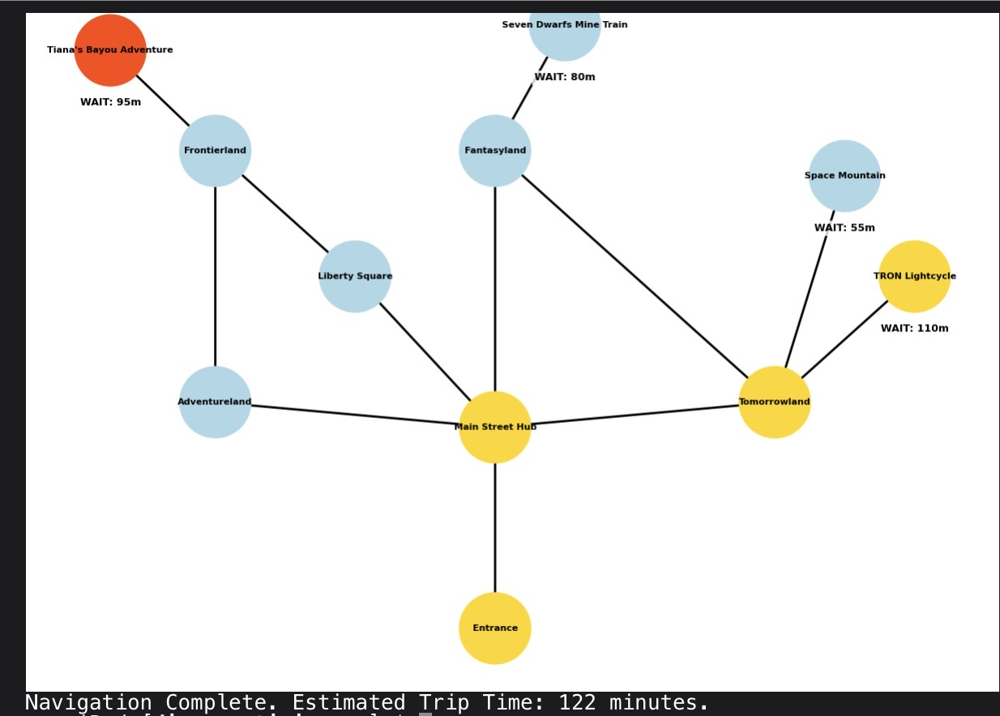

# Magic Kingdom Logistics & Pathfinding Engine

### Project Overview
This project is a high-scale logistical simulation of **Walt Disney World's Magic Kingdom**. Using Python and graph theory, it calculates the most efficient route for guests by balancing physical walking distances with real-time attraction wait times.

### Key Technical Features
* **Weighted Graph Modeling**: The park is modeled as a network where attractions are nodes and walkways are edges, using the `NetworkX` library.
* **Dynamic Cost Heuristics**: Unlike standard GPS, this engine uses a custom algorithm where `Total Cost = Walking Time + Queue Wait Time`.
* **Congestion Management**: The system identifies "High-Stress" attractions (wait times > 90m) and automatically reroutes guest flow to lower-latency areas.
* **2026 Fleet Update**: Includes modern high-demand attractions like **TRON Lightcycle / Run** and **Tiana's Bayou Adventure**.

### Technologies Used
- **Language**: Python 3
- **Libraries**: `networkx` (Graph Theory), `matplotlib` (Data Visualization)

### How It Works
The engine evaluates multiple paths between Lands (e.g., Tomorrowland to Fantasyland). If the "Castle Hub" is congested, the algorithm recalculates the route through side paths to minimize the guest's total "Time-to-Attraction."

---
*Developed for the Disney Professional Internship Application.*

